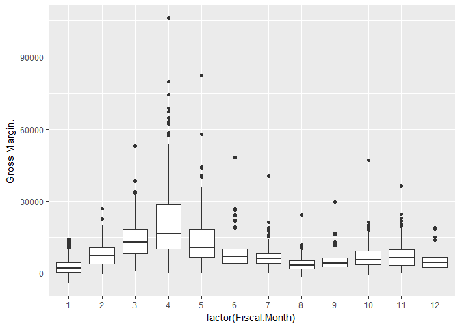
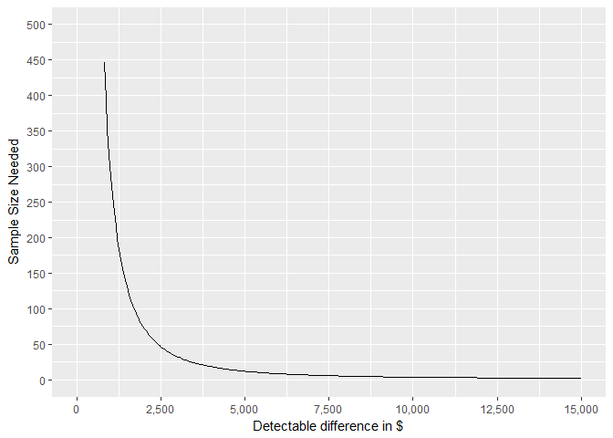

   

## Choosing the right sample size for A/B testing
### This markdown shows the basics of sample size estimation. In this example I show how I helped a company determine the correct sample size to test their hypothesis. The company was interested in determining whether removing a cohort of less desirable SKU's from a group of stores would decrease total profitability in those stores. To do this I used a technique called 'Power Analysis'.

### Performing power analysis and sample size estimation is an important aspect of setting up an experiment, because without these calculations, sample size may be too high or too low. If sample size is too low, the experiment will lack the precision to provide reliable answers to the questions it is investigating. If sample size is too large, time and resources will be wasted, often for minimal gain. 

### Power is the probability of rejecting a null hypothesis when it is false i.e. not committing a type 2 error. Therefore, we need to define what "false" means to us in the context of our problem. In this example, the null hypothesis should be a one-sided test that profitability in the test groups is lower than profitability in the control groups. Therefore, "false" in this example would be the opposite, that profitability is higher in the test groups that have less SKU's.

### I was able to find a power analysis package in R that allows us to solve for the optimal sample size based on significance level, power, and detectable difference. Below I have outlined the steps used to determine these 3 parts of the equation.
1. Define the Null Hypothesis:
- H0: Sales in the test groups and less than the control groups
- H1: Sales in the test groups are higher than the control groups 
This is a one-sided hypothesis, since we are only testing if the sales increased.

2. Determining Power and Significance Level
- Type 1 Error (False Positive): Rejecting the null hypothesis when is it actually true 
- Type 2 Error (False Negative): Failing to reject the null hypothesis when it is actually false.      
The probability of committing a Type 1 error is called the significance level.    
The probability of committing a Type 2 error is called the power.

- A typical requirement for the power is 80%. In other words, we will tolerate a 20% chance of a type 2 error (1 - power). The typical requirement for the significance level is 5%.

3. Determining what a proper detectable difference should be
For this problem, the detectable difference is the difference in sales between test and control stores that would be considered "significant". We cannot solve for the sample size without first specifying the level of impact we want to be able to detect with our test. The key is to define what "pay off" means for this study, which depends on what would be considered a success as well as the cost of running the study. Since I didn't have exact cost estimates that it would take to run this study I asked for a range and used this in my analysis. Using a range also allowed us to see exactly how the minimum sample size relates with a change in detectable differences. 

Below I will walk through the steps described with actual data:

First, I want to do a cursery glance at the data to make sure it is structured correctly and looks reasonable.                                   
1. I am mainly concerned with the Sales column. It appears that there is a least one row with zero sales. I will need to get rid of these.
2. I don't see any null values. This is great.

```r
str(sales_raw)
```

```
## 'data.frame':	2308 obs. of  13 variables:
##  $ Macro.Region   : Factor w/ 1 level "SOUTHEAST": 1 1 1 1 1 1 1 1 1 1 ...
##  $ Sub.Region     : num  10 10 10 10 10 10 10 10 10 10 ...
##  $ Region         : Factor w/ 2 levels "Region 1","Region 2": 1 1 1 1 1 1 1 1 1 1 ...
##  $ Address        : Factor w/ 195 levels "1001 WEST OAKLAND PARK BLVD",..: 2 2 2 2 2 2 2 2 2 2 ...
##  $ ZIP            : int  33928 33928 33928 33928 33928 33928 33928 33928 33928 33928 ...
##  $ City           : Factor w/ 162 levels "ALACHUA","ALBANY",..: 46 46 46 46 46 46 46 46 46 46 ...
##  $ State          : Factor w/ 4 levels "AL","FL","GA",..: 2 2 2 2 2 2 2 2 2 2 ...
##  $ Store.Code     : int  2362 2362 2362 2362 2362 2362 2362 2362 2362 2362 ...
##  $ Customer.Market: Factor w/ 20 levels "EA","EB","EF",..: 7 7 7 7 7 7 7 7 7 7 ...
##  $ Fiscal.Year    : int  2017 2017 2017 2017 2017 2017 2017 2017 2017 2017 ...
##  $ Fiscal.Month   : int  1 2 3 4 5 6 7 8 9 10 ...
##  $ Sales..        : int  38271 34711 40329 30940 28324 19073 19049 13013 13868 34593 ...
##  $ Gross.Margin.. : int  11744 11087 11928 7347 6992 5157 5401 4164 3670 10297 ...
```

```r
summary(sales_raw)
```

```
##     Macro.Region    Sub.Region          Region    
##  SOUTHEAST:2308   Min.   : 7.000   Region 1:1477  
##                   1st Qu.: 8.000   Region 2: 831  
##                   Median : 9.000                  
##                   Mean   : 8.704                  
##                   3rd Qu.: 9.100                  
##                   Max.   :10.100                  
##                                                   
##                         Address          ZIP                  City     
##  1001 WEST OAKLAND PARK BLVD:  12   Min.   :29406   JACKSONVILLE:  60  
##  10070 ESTERO TOWN          :  12   1st Qu.:31058   TAMPA       :  60  
##  101 WILLOW LANE            :  12   Median :32571   ORLANDO     :  49  
##  103 SOUTH STATE RD 7       :  12   Mean   :32389   GAINESVILLE :  36  
##  1030 GLYNN STREET          :  12   3rd Qu.:33647   OCALA       :  36  
##  10425 GIBSONTON            :  12   Max.   :36526   ALPHARETTA  :  24  
##  (Other)                    :2236                   (Other)     :2043  
##  State       Store.Code   Customer.Market  Fiscal.Year    Fiscal.Month   
##  AL:  38   Min.   :  33   SA     :432     Min.   :2017   Min.   : 1.000  
##  FL:1477   1st Qu.: 704   FL     :300     1st Qu.:2017   1st Qu.: 4.000  
##  GA: 684   Median :1683   FB     :253     Median :2017   Median : 6.500  
##  SC: 109   Mean   :1588   EB     :156     Mean   :2017   Mean   : 6.503  
##            3rd Qu.:2360   FA     :132     3rd Qu.:2017   3rd Qu.:10.000  
##            Max.   :3350   FC     :132     Max.   :2017   Max.   :12.000  
##                           (Other):903                                    
##     Sales..       Gross.Margin..  
##  Min.   :     0   Min.   : -4160  
##  1st Qu.: 14213   1st Qu.:  3206  
##  Median : 23178   Median :  6106  
##  Mean   : 29746   Mean   :  8520  
##  3rd Qu.: 37528   3rd Qu.: 10662  
##  Max.   :265641   Max.   :106213  
## 
```

```r
colSums(sapply(sales_raw,is.na))
```

```
##    Macro.Region      Sub.Region          Region         Address 
##               0               0               0               0 
##             ZIP            City           State      Store.Code 
##               0               0               0               0 
## Customer.Market     Fiscal.Year    Fiscal.Month         Sales.. 
##               0               0               0               0 
##  Gross.Margin.. 
##               0
```

Next I take a look at how sales vary over the course of the year. The company that I am consulting for want to run their A/B test in the 4th quarter of the year. It looks like the mean and variance of these months are fairly stable.

```r
ggplot(data=sales_raw)+
  geom_boxplot(aes(x=factor(Fiscal.Month),y=Sales..))
```

<!-- -->

```r
sales_raw <- sales_raw[sales_raw$Sales..>100,]
```

In order to run the power analysis I need 4 pieces of information:       
1. Standard Deviation - Below I find the standard deviation of the 3 months in the last quarter of the year.       
2. Power - I am going to use 80%.           
3. Significance Level - I am going to use 5%.           
4. Detectable Difference - I am going to use each multiple of 50 from $500 to $15,000.              

```r
sales_stats<-sales_raw%>%
  group_by(factor(Fiscal.Month))%>%
  summarise(std_dev = sd(Sales..))
mean(sales_stats[sales_stats$`factor(Fiscal.Month)`%in%c(10,11,12),]$std_dev)
```

```
## [1] 13254.41
```


This code builds out a data frame that has two columns:  
1. The Detectable Differences that I want to iterate the power.t.test function over.   
2. The results of the power.t.test function i.e. the sample size required to detect with 80% power for each Detectable Difference level. 

```r
sd1 <-  13254 # std dev of sales
b <- 0.8 # power 
a <- 0.05 # significance level
dd <- seq(from = 500, to = 15000, by = 50) # detectable differences
result <- data.frame(matrix(nrow = length(dd), ncol = 2))
names(result) <- c("DD", "ni")
for (i in 1:length(dd)) {
  result[i, "DD"] <- dd[i]
  number <- power.t.test(n=NULL, delta = dd[i], sd=sd1, sig.level=a, power=b,
                         alternative = 'two.sided')  
  result[i, "ni"] <-number$n
}
```

This plot shows the results of the power.t.test for each level of detectable difference. The higher we choose to set the detectable difference, the less observations we need in the sample. Therefore, I need to set up another meeting with this company to determine how much money it would cost to implement this test. This would determine our threshold for detectable diffence.

```r
ggplot(data = result, aes(x = DD, y = ni)) +
  geom_line() + ylab("n") + xlab("Detectable difference") + 
  scale_x_continuous(labels = comma, breaks = seq(0,15000,2500))+
  scale_y_continuous(labels = comma, breaks = seq(0,10000,1000))
```

<!-- -->

```r
ggplot(data = result, aes(x = DD, y = ni)) +
  geom_line() + ylab("n") + xlab("Detectable difference") + 
  scale_x_continuous(labels = comma, breaks = seq(0,10000,1000), limits = c(5000,10000)) +
  scale_y_continuous(labels = comma,breaks = seq(0,100,10), limits = c(30,100))
```

<!-- -->


```
